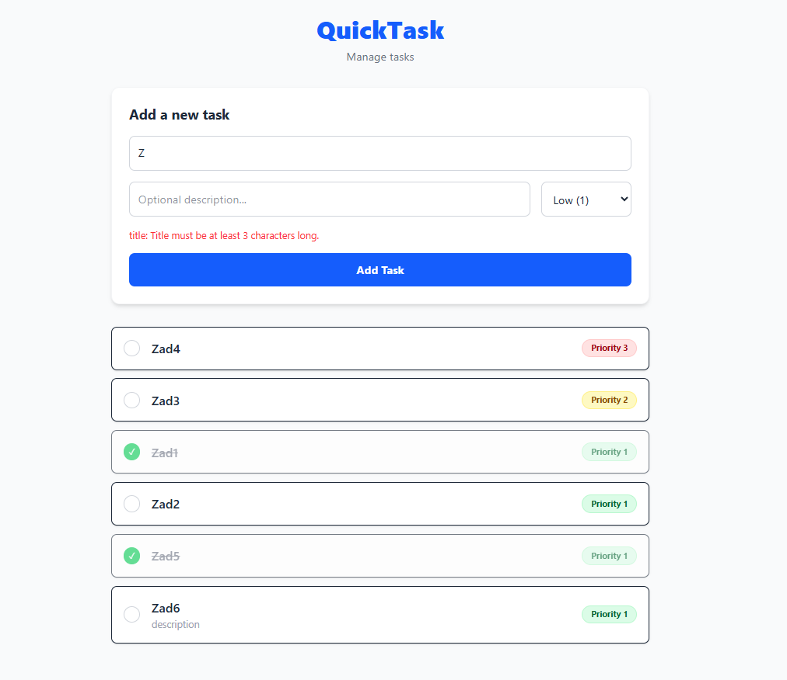

# QuickTask Project

## Backend (Symfony 8)

**Setup**
1. Navigate to `/backend`.
2. Install dependencies: `composer install`
3. Configure `.env` (set `DATABASE_URL`).
4. Initialize database:
   `php bin/console doctrine:database:create`
   `php bin/console doctrine:migrations:migrate`
5. Start server: `symfony server:start` (runs at http://127.0.0.1:8000)

**Testing API (Endpoints)**
* **Create Task:** `POST /api/tasks`
    * Headers: `Content-Type: application/json`, `Accept: application/json`
    * Body: `{"title": "Test Task", "priority": 3, "description": "Optional"}`
* **List Tasks:** `GET /api/tasks`
* **Update Status:** `PATCH /api/tasks/{id}`
    * Body: `{"status": true}`

---

## Frontend (React + TypeScript + Tailwind)

**Setup**
1. Navigate to `/frontend`.
2. Install dependencies: `npm install`
3. Start dev server: `npm run dev`
4. Open http://localhost:5173

**Testing UI**
1. **Validation:** Try creating a task with too short (less than 3 chars) title. Expect a specific error message from the backend.
2. **Priorities:** Create tasks with different priorities (1-3) to see different badge colors.
3. **Status:** Click on a task to toggle its completion status (visual change + API call).

